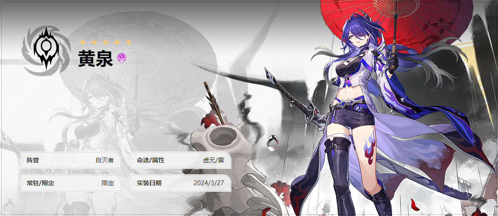
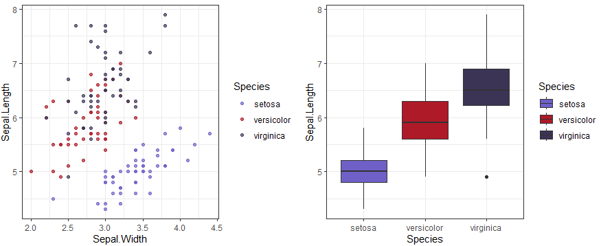
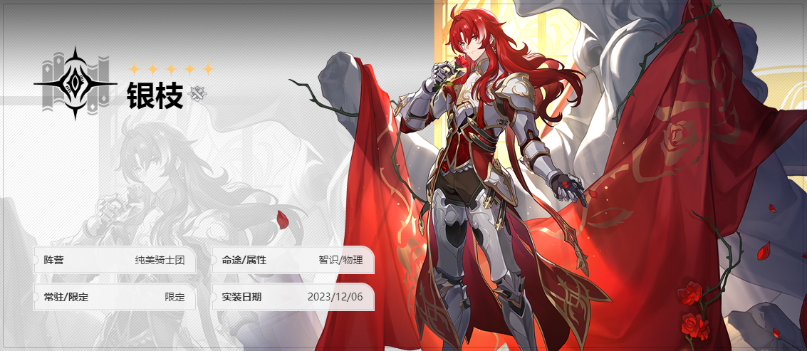
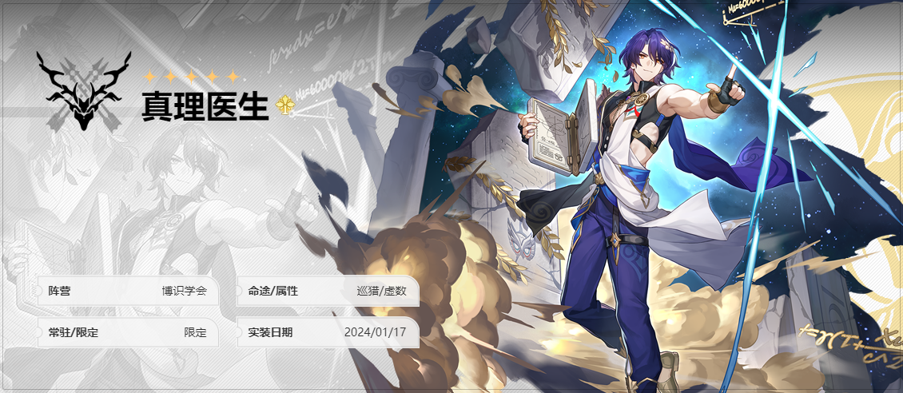
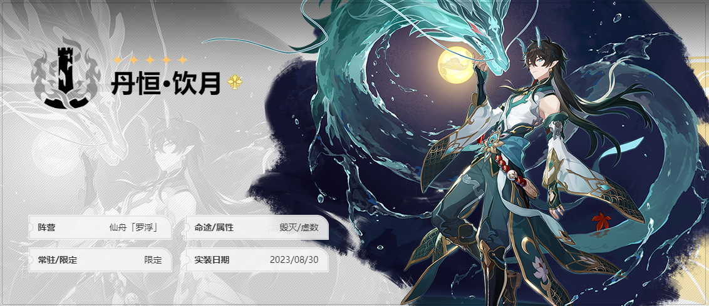
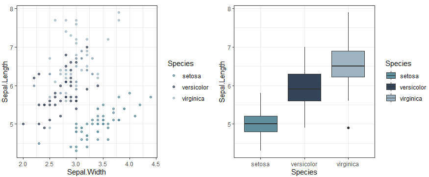
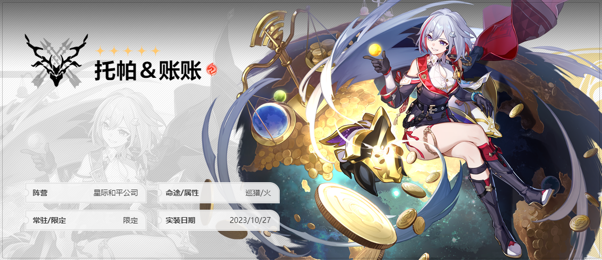

# ggStarRail

a collection of StarRail-styled color schemes.

## Installation

You can install ggStarRail on GitHub:

``` r
remotes::install_github("GuoXiang9399/ggStarRail")
```
## Gallery

``` r 
#loading package
  library(ggplot2)
  library(ggStarRail)
  library(scales)
  library(cowplot)
#data
  data("iris")
#plot
  p1 <- ggplot(iris) +
    geom_point(aes(x = Sepal.Width, y = Sepal.Length, colour = Species), 
      alpha = 0.7) +
      theme_bw()
  p2 <- ggplot(iris)+
    geom_boxplot(aes(x = Species, y = Sepal.Length, fill = Species))+
      theme_bw()
```

### 黄泉 Acheron 



``` r 
  plot_grid(
    p1+scale_color_Acheron(),
    p2+scale_fill_Acheron())

```



### 银枝 Argenti



### 克拉拉 Clara


``` r 
  plot_grid(
    p1+scale_color_Clara(),
    p2+scale_fill_Clara())

```

### 真理医生 Dr. Ration




### 霍霍 Huohuo


### 丹恒·饮月 Dan Heng·Imbibitor Lunae




``` r 
  plot_grid(
    p1+scale_color_ImbibitorLunae(),
    p2+scale_fill_ImbibitorLunae())

```

### 镜流 Jingliu


``` r 
  plot_grid(
    p1+scale_color_Jingliu(),
    p2+scale_fill_Jingliu())

```

### 阮梅 Ruan Mei 


``` r 
  plot_grid(
    p1+scale_color_RuanMei(),
    p2+scale_fill_RuanMei())

```




### 托帕 Topaz



``` r 
  plot_grid(
    p1+scale_color_Topaz(),
    p2+scale_fill_Topaz())

```

### 瓦尔特


### 彦卿 Yanqing


